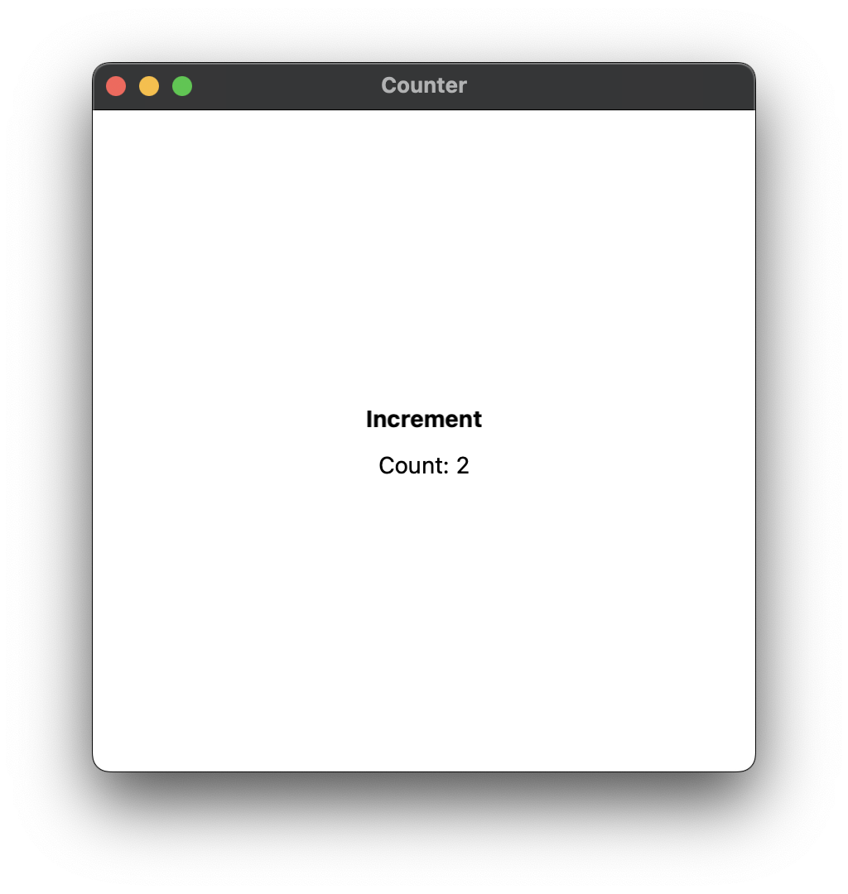

# Quarve

Quarve is an experimental rust UI library for desktop applications.
It was made to develop [Monocurl](https://www.monocurl.com),
a mathematical animation app, but can be used more generally.

## Example

Button and counter example.
```rust
fn counter(s: MSlock) -> impl IVP {
    // state
    let count = Store::new(0);
    let count_binding = count.binding();
    let count_label = count.map(|c| format!("Count: {:?}", c), s);

    // views
    let button = button("Increment", move |s| {
        count_binding.apply(NumericAction::Incr(1), s);
    });
    let display = Text::from_signal(count_label);

    vstack()
        .push(button.bold())
        .push(display)
        .text_color(BLACK)
        .frame(F.intrinsic(400, 400).align(Center).unlimited_stretch())
        .background(WHITE)
}
```
Preview


## Installation
After installing cargo, run
```shell
cargo install quarve_cli
```
You can then create a Quarve project with the command
```quarve new <name>```.
Run the project either by running it as a normal rust binary
or by using ```quarve run```.

## Design Principles
We designed Quarve to satisfy the core principles:

1. *Multithreaded* Quarve extends rust's fearless concurrency to
multithreaded app development.
2. *Declarative* We aim to make the syntax of Quarve convenient to read,
without overly relying on macros. Quarve also follows the pattern of
composability, allowing for reusable and easy-to-understand code.
3. *Rust-first* As opposed to being a port of a UI library designed for
another language, Quarve is built around the features
that define rust: monomorphism, thread safety, advanced types, speed, and more.
4. *Native* Quarve views are native-backed, avoiding web browsers and gpu renderers.
This allows for small installation size and memory footprint.
5. *Fast* We do not use virtual doms and aim for minimal overheard
compared to a fully native application
(there is still have some work to do).

Currently, Quarve is implemented for macOS, Windows and Linux.
There are lots of features that are yet to be added,
but you can still do a lot with the basics.

## Learning
This book is split into several sections. Rather than reading
each section completely one-by-one, we recommend skimming each section
until you have an intution of how that part of Quarve works and returning
whenever you need to reference details. Nevertheless, make sure to follow along!

Documentation is available at [docs.rs](https://docs.rs/quarve/0.1.0/quarve/).

For further learning, we recommend looking through
the [Monocurl](https://github.com/monocurl/monocurl) source code
as it is the most complex application using Quarve.
Otherwise, feel free to ask for help in the
[Discord server](https://discord.gg/7g94JR3SAD).
